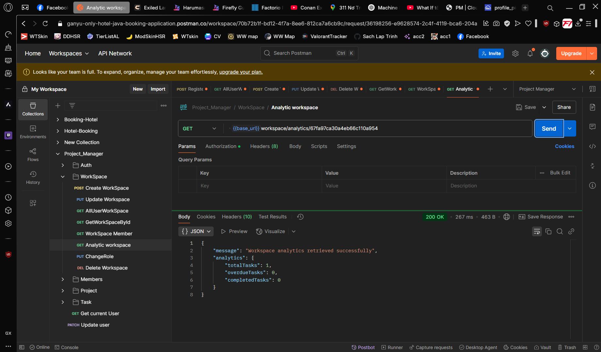
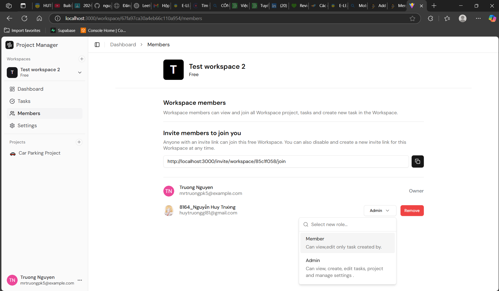
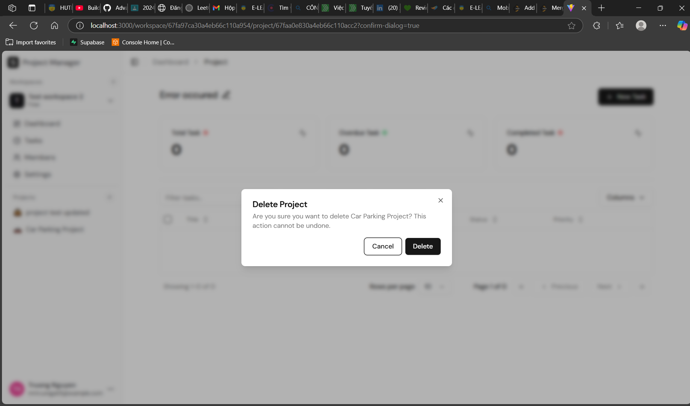
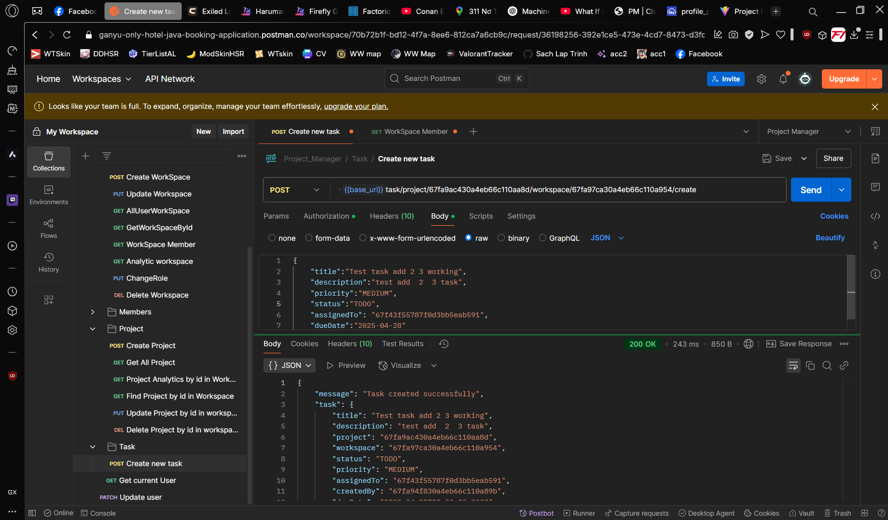

> **CHƯƠNG 1: GIỚI THIỆU ĐỀ TÀI & CÁC CHỨC NĂNG THỰC HIỆN ĐƯỢC**

1.  **Lý do chọn đề tài**

> Trong thời đại công nghệ số hiện nay, việc quản lý công việc và dự án
> một cách hiệu quả là nhu cầu thiết yếu của các tổ chức và cá nhân. Hệ
> thống quản lý công việc (Task Management System) được phát triển nhằm
> đáp ứng các nhu cầu sau:
>
> \- Nhu cầu thực tế: Các tổ chức và nhóm làm việc cần một công cụ để
> theo dõi, quản lý và phối hợp thực hiện các nhiệm vụ một cách hiệu
> quả.
>
> \- Giải quyết vấn đề: Hệ thống giúp giải quyết các vấn đề như:
>
> \+ Khó khăn trong việc theo dõi tiến độ công việc
>
> \+ Thiếu sự phối hợp giữa các thành viên trong nhóm
>
> \+ Khó khăn trong việc phân công và quản lý nhiệm vụ
>
> \+ Thiếu công cụ để đánh giá hiệu suất làm việc
>
> \- Tính ứng dụng cao: Hệ thống có thể áp dụng cho nhiều lĩnh vực và
> quy mô tổ chức khác nhau.

2.  **Đối tượng nghiên cứu và công cụ sử dụng**

    1.  **Đối tượng nghiên cứu**

> \- Hệ thống quản lý công việc và dự án
>
> \- Quy trình làm việc của các tổ chức
>
> \- Nhu cầu quản lý và theo dõi công việc
>
> \- Các phương pháp quản lý dự án hiện đại

2.  **Đối tượng nghiên cứu**

> **- BackEnd :**
>
> \+ Node.js : Môi trường thực thi JavaScript server-side

\+ TypeScript : Ngôn ngữ lập trình với kiểu dữ liệu tĩnh

\+ Express.js : Framework web cho Node.js

\+ MongoDB : Cơ sở dữ liệu NoSQL

\+ Mongoose : ODM cho MongoDB

\+ JWT : Xác thực và phân quyền

\+ Multer : Xử lý upload file

\+ Cloudinary: Để lưu trữ ảnh

> **- FrontEnd:**
>
> \+ React.js: Thư viện JavaScript cho xây dựng giao diện người dùng
>
> \+ TypeScript: Ngôn ngữ lập trình với kiểu dữ liệu tĩnh
>
> \+ TanStack Query: Quản lý state và caching
>
> \+ React Hook Form: Xử lý form
>
> \+ Zod: Validation schema
>
> \+ Tailwind CSS: Framework CSS
>
> \+ Shadcn/ui: Component library

3.  **Các chức năng đã thực hiện được**

    1.  **Quản lý Workspace**

> \- Tạo , xóa , sửa workspace
>
> \- Thêm/xóa thành viên vào workspace
>
> \- Phân quyền cho thành viên
>
> \- Thống kê hoạt động trong workspace

2.  **Quản lý Project**

> \- Tạo , xóa , sửa dự án
>
> \- Thống kê dự án (tổng task, task hoàn thành, task quá hạn)

3.  **Quản lý Task**

> \- Tạo , xóa , sửa Task
>
> \- Phân loại task theo trạng thái (TODO, IN_PROGRESS, DONE)
>
> \- Phân loại task theo mức độ ưu tiên (LOW, MEDIUM, HIGH)
>
> \- Gán task cho thành viên
>
> \- Thiết lập deadline cho task
>
> \- Theo dõi tiến độ task

4.  **Quản lý User**

> \- Đăng ký và đăng nhập tài khoản
>
> \- Cập nhật thông tin cá nhân
>
> \- Quản lý avatar/profile picture
>
> \- Xác thực và phân quyền người dùng

5.  **Thống kê và Báo cáo**

> \- Thống kê tổng quan workspace
>
> \- Thống kê chi tiết project
>
> \- Theo dõi tiến độ công việc
>
> \- Báo cáo hiệu suất làm việc

6.  **Tính năng bảo mật**

> \- Xác thực người dùng bằng JWT
>
> \- Phân quyền chi tiết cho từng chức năng
>
> \- Bảo vệ API endpoints
>
> \- Xử lý lỗi và exception

7.  **Giao diện người dùng**

> \- Responsive design
>
> \- Drag and drop interface
>
> \- Real-time updates
>
> \- Thông báo và alerts
>
> \- Giao diện thân thiện với điện thoại
>
> **CHƯƠNG 2: KẾT QUẢ CÁC CHỨC NĂNG**

1.  **Chức năng đăng ký người dùng**

> 
> 
>
> **Hình 1** **Chức năng đăng ký người dùng.**

2.  **Chức năng đăng nhập**

> 
>
> {width="6.5in"
> height="3.829861111111111in"}
>
> **Hình 2 Chức năng đăng nhập của người dùng.**

3.  **Chức năng lấy tất cả workspace của người dùng.**

> 
> 
>
> **Hình 3 Lấy tất cả workspace của người dùng.***\
> *

4.  **Chức năng tạo workspace mới.**

> 
>
> 
>
> 
>
> **Hình 4 Tạo workspace mới.**

5.  **Chức năng cập nhật workspace.**

> 
>
> 
>
> **Hình 5 Cập nhật workspace.**

6.  **Chức năng xóa workspace.**

> 
> 
>
> **Hình 6 Xóa workspace.**

7.  **Chức năng lấy workspace theo id**

> 
>
> 
>
> **Hình 7 Lấy workspace theo id***.*

8.  **Chức năng lấy member theo workspace id**

> 
>
> 
>
> **Hình 8 Lấy member theo workspace id.*\
> ***

9.  **Chức năng thống kê trong workspace.**

> 
> 
>
> **Hình 9 Thống kê trong workspace.**

10. **Chức năng thay đổi role người dùng trong workspace.**

> 
> 
>
> **Hình 10 Thay đổi role người dùng trong workspace.**

11. **Chức năng mời người dùng vào workspace.**

> 
> 
>
> **Hình 11 Chức năng mời người dùng vào workspace.***\
> *

12. **Chức năng xóa người dùng khỏi workspace.**

> 
> 
>
> **Hình 12 Chức năng xóa người dùng khỏi workspace.***\
> *

13. **Chức năng lấy tất cả project trong workspace.**

> 
> 
>
> **Hình 13 Lấy tất cả project trong workspace.***\
> *

14. **Chức năng tạo project mới trong workspace.**

> 
> 
>
> **Hình 14 Tạo project mới trong workspace.**

15. **Chức năng cập nhật project bằng id**

> 
> 
>
> **Hình 15 Cập nhật project bằng id**

16. **Chức năng tìm kiếm project bằng id**

> 
> 
>
> **Hình 16 Tìm kiếm project bằng id.**

17. **Chức năng xóa project của người dùng**

> 
> 
>
> **Hình 17 Xóa project của người dùng.**

18. **Chức năng lấy thống kê của Project theo id**

> 
>
> 
>
> **Hình 18 Lấy thống kê của Project theo id.**

19. **Chức năng tạo Task mới trong project**

> 
> 
> 
> **Hình 19 Tạo Task mới trong project.**

20. **Chức năng lấy tất cả task trong workspace**

> 
> 
>
> **Hình 20 Lấy tất cả các task trong workspace.**

21. **Chức năng cập nhật thông tin Task theo id**

> 
> 
>
> **Hình 21 Cập nhật thông tin Task theo id.**

22. **Chức năng xóa task trong project**

> 
> 
>
> **Hình 22 Xóa task trong project.**

23. **Chức năng lấy người dùng hiện tại**

> 
> 
>
> **Hình 23 Lấy người dùng hiện tại.**

24. **Chức năng cập nhật người dùng**

> 
>
> 
>
> **Hình 24 Cập nhật người dùng.**
>
> 
>
> **Hình 25 Hình ảnh được lưu trên Cloudinary.**
>
> **CHƯƠNG 3: TỔNG KẾT**

1.  **Tổng kết (Các chức năng đã thực hiện được)**

> **Đồ án đã deploy thành công:**
>
> **https://project-manager-front-end-x317-bahfzsaur.vercel.app/**
>
> **Các chức năng đã thực hiện được :**

1.  **Quản lý Workspace**

> \- Tạo , xóa , sửa workspace
>
> \- Thêm/xóa thành viên vào workspace
>
> \- Phân quyền cho thành viên
>
> \- Thống kê hoạt động trong workspace

2.  **Quản lý Project**

> \- Tạo , xóa , sửa dự án
>
> \- Thống kê dự án (tổng task, task hoàn thành, task quá hạn)

3.  **Quản lý Task**

> \- Tạo , xóa , sửa Task
>
> \- Phân loại task theo trạng thái (TODO, IN_PROGRESS, DONE)
>
> \- Phân loại task theo mức độ ưu tiên (LOW, MEDIUM, HIGH)
>
> \- Gán task cho thành viên
>
> \- Thiết lập deadline cho task
>
> \- Theo dõi tiến độ task

4.  **Quản lý User**

> \- Đăng ký và đăng nhập tài khoản
>
> \- Cập nhật thông tin cá nhân
>
> \- Quản lý avatar/profile picture
>
> \- Xác thực và phân quyền người dùng

5.  **Thống kê và Báo cáo**

> \- Thống kê tổng quan workspace
>
> \- Thống kê chi tiết project
>
> \- Theo dõi tiến độ công việc
>
> \- Báo cáo hiệu suất làm việc

6.  **Tính năng bảo mật**

> \- Xác thực người dùng bằng JWT
>
> \- Phân quyền chi tiết cho từng chức năng
>
> \- Bảo vệ API endpoints
>
> \- Xử lý lỗi và exception

7.  **Giao diện người dùng**

> \- Responsive design
>
> \- Drag and drop interface
>
> \- Real-time updates
>
> \- Thông báo và alerts
>
> \- Giao diện thân thiện với điện thoại

2.  **Hướng phát triển**

    1.  **Tính năng mới**

> \- Chat real-time
>
> \- Calendar và nhắc nhở

2.  **Cải tiến**

> \- UI/UX (Dark mode, Responsive)
>
> \- Performance (Caching, Lazy loading)

3.  **Mở rộng**

> \- Mobile App
